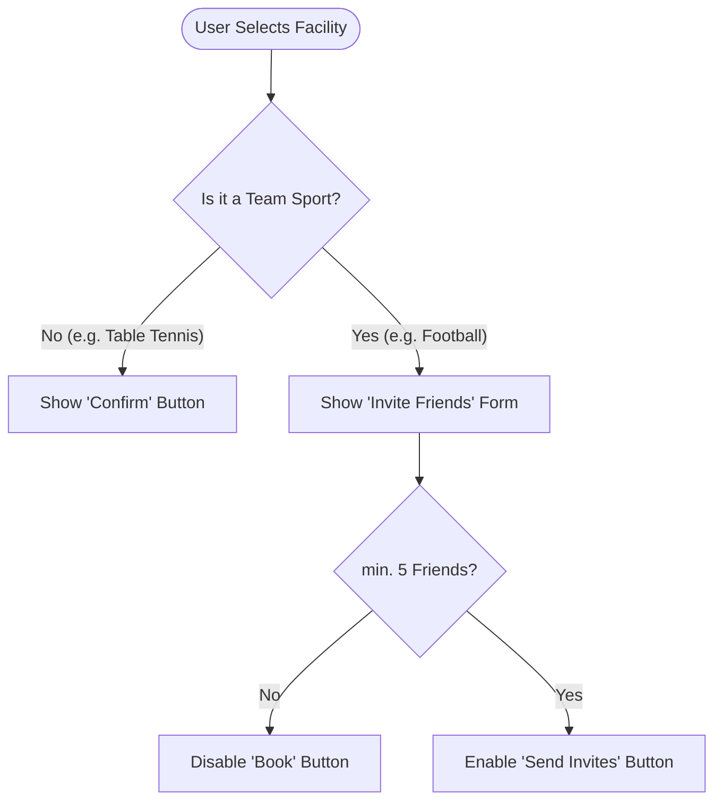
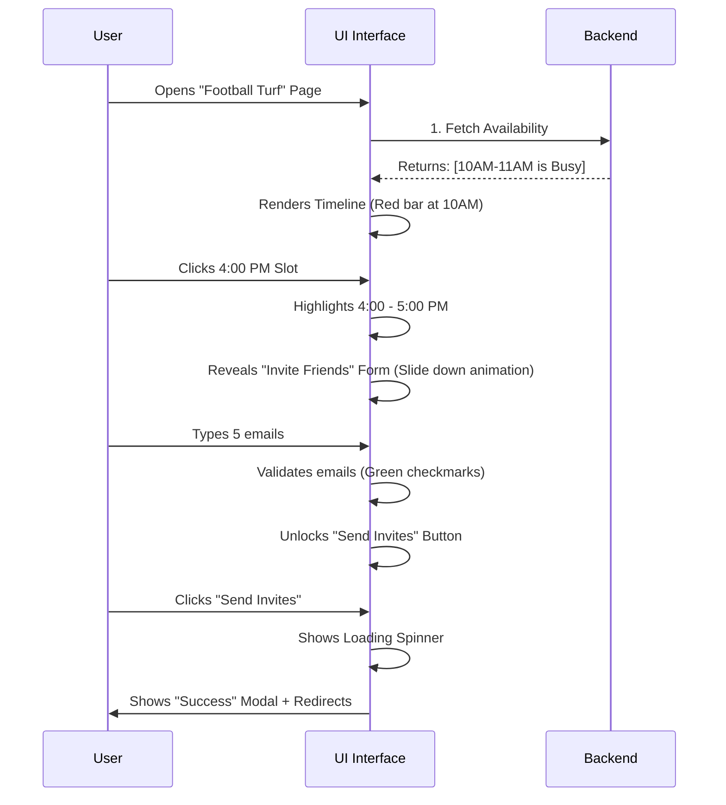
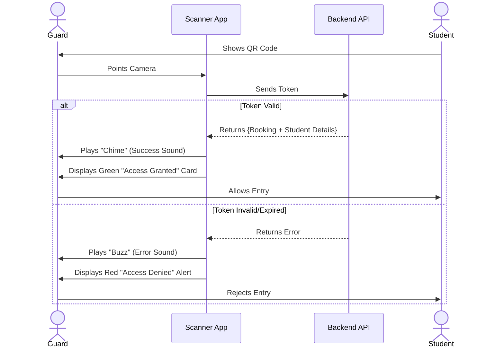
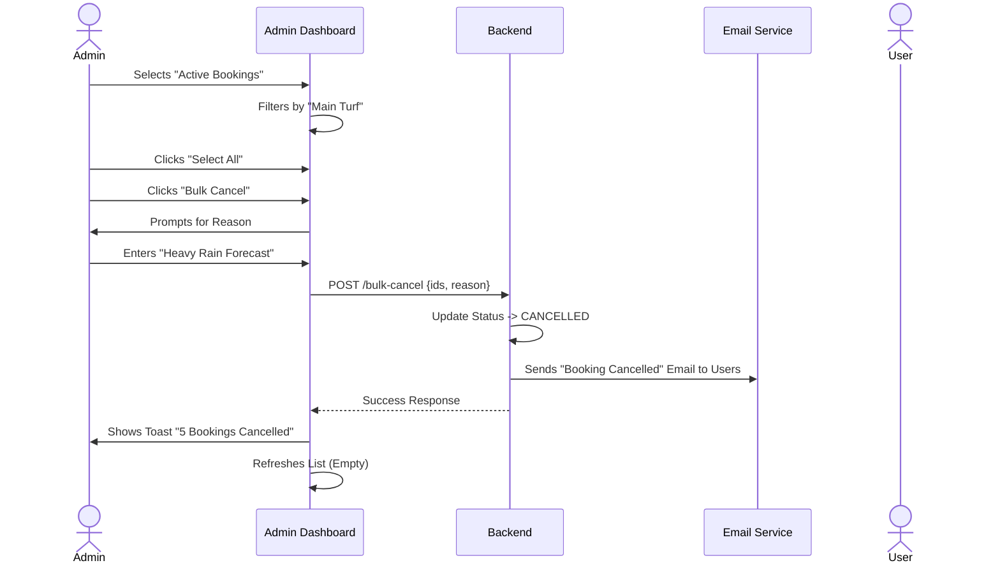

# � Product Design Spec: Facilities Booking Experience

**Project:** SST Booking System - Facilities Module  
**Audience:** UI/UX Designers, Product Managers  
**Status:** Ready for Design Review  

---

## 1. Design Objective
Create a seamless, premium mobile-first experience for students to book sports infrastructure. The interface must balance **speed** for individual users (e.g., booking a Table Tennis table) with **clarity** for complex group coordination (e.g., organizing a football match).

### Core Design Values
*   **Clarity**: Instant visibility of "What is available right now?"
*   **Speed**: Minimized clicks to confirm a booking.
*   **Premium Feel**: Use glassmorphism, dark mode aesthetics, and fluid micro-interactions to reflect a high-tech campus environment.

---

## 2. User Flows & Key Screens

### 2.1 The Discovery Dashboard (Home)
**User Goal:** "I want to see what I can play right now."

*   **UI Requirement:** A grid of "Facility Cards".
*   **Visual Hierarchy:**
    1.  **Sport Emoji/Icon**: Immediate recognition.
    2.  **Status Badge**: "Available" (Green) vs "Full" (Red).
    3.  **Name**: e.g., "Main Turf".
*   **Interaction:** Hovering over a card should trigger a subtle lift/glow effect.

### 2.2 The Time Scanner (Booking Interface)
**User Goal:** "I need a slot between 5 PM and 7 PM."

*   **Primary Component: The Timeline Picker**
    *   **Visual Metaphor**: A horizontal day timeline.
    *   **States**:
        *   🟩 **Green Zone**: Available time.
        *   🟥 **Red Zone**: Already booked (Busy).
        *   ⬜ **Gray Zone**: Past time/Closed.
        *   ✨ **Glow/Highlight**: The currently selected duration (e.g., 1 hour).
*   **Controls**:
    *   **Duration Pill**: User selects how long they want to play (15m, 30m, 1h, 2h).
    *   **Date Switcher**: Horizontal scroll or calendar modal for next 7 days.

### 2.3 logic Branch: Individual vs. Group
The system behaves differently based on the facility type.

### 2.4 The Guard Interface (Access Control)
**User Goal:** "Verify student entitlement and log entry/exit."

*   **Primary Interaction**: One-tap QR Scanner (Camera or Manual Code Entry).
*   **Feedback States**:
    *   ✅ **Valid**: High-pitched chime + Green Screen + Student Details (Name, Photo).
    *   ❌ **Invalid/Expired**: Low buzz + Red Screen + Error Message ("Booking Expired").
*   **Key Information Displayed**:
    *   **Resource**: "Basketball Court"
    *   **Time Remaining**: "45 mins left"
    *   **Identity**: Name & Roll Number (to prevent ID swapping).

### 2.5 The Admin Portal (Oversight)
**User Goal:** "Manage facility usage and handle exceptions."

*   **Dashboard Features**:
    *   **Live Feed**: Real-time list of all active/upcoming bookings.
    *   **Filters**: "Active", "Completed", "Cancelled".
*   **Critical Actions**:
    *   **Force Cancel**: Remove a booking (e.g., for unexpected maintenance).
        *   *UI*: Red outline button -> Modal -> Reason Input.
    *   **Bulk Select**: Cancel multiple bookings at once (e.g., Rainy day closes open turf).

---

## 3. Interaction Patterns & Per-Persona Flows

### 3.1 Scenario: The "Happy Path" Group Booking (Student)

### 3.2 Scenario: Guard Check-In Flow
How the Guard validates a student.

### 3.3 Scenario: Admin Override
When an admin needs to intervene (e.g., Force Cancel for Rain).

---

## Appendix: Developer Constraints
*(For reference - Design does not need to solve these, but should be aware)*
*   **Latency**: Checking availability might take ~500ms. UI needs to handle this delay gracefully.
*   **Race Conditions**: Two users might book the same slot simultaneously. The second user will get an error on submit. Plan for an alert: "Sorry, this slot was just taken."
*   **Timezones**: All times are IST. Design should clearly state "IST" if ambiguous.
