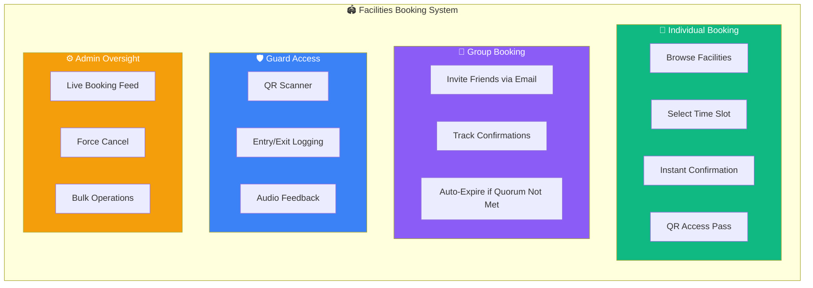
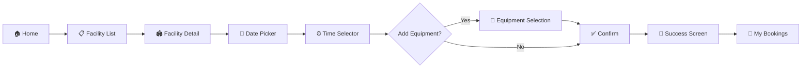
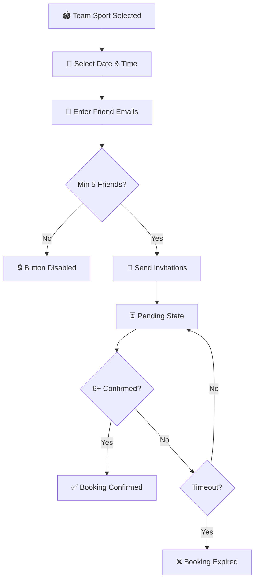
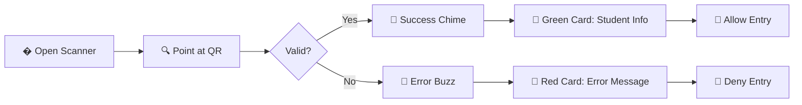
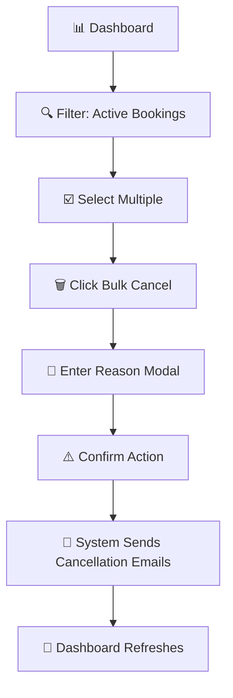
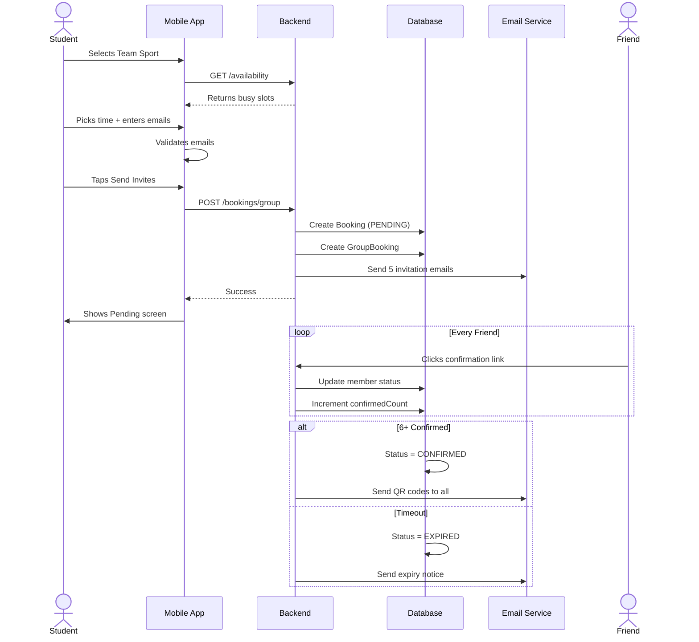
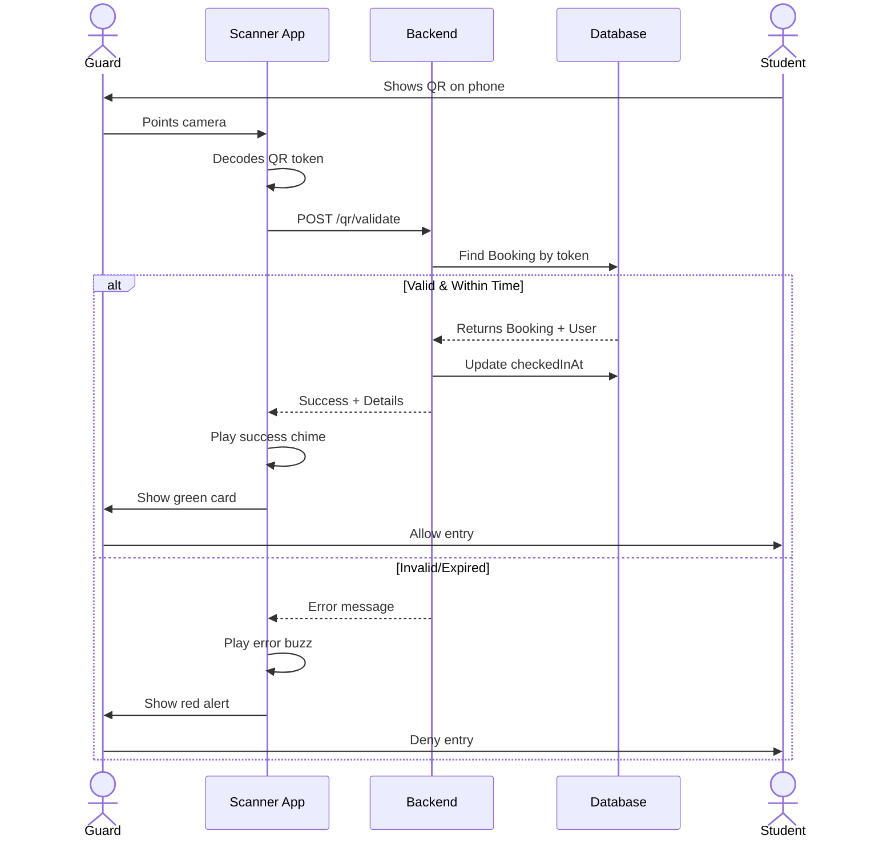
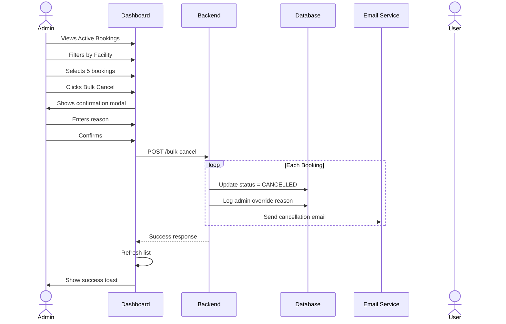

# 🏟️ SST Facilities Booking — Product Design Specification

> **Project:** SST Campus Booking System   

---

## Table of Contents
1. [Product Overview](#1-product-overview)
2. [User Personas](#2-user-personas)
3. [User Flows by Persona](#3-user-flows-by-persona)
4. [Screen-by-Screen Breakdown](#4-screen-by-screen-breakdown)
5. [UI Components Library](#5-ui-components-library)
6. [State Management & Feedback](#6-state-management--feedback)
7. [Visual Design System](#7-visual-design-system)
8. [Interaction Diagrams](#8-interaction-diagrams)
9. [Edge Cases & Error Handling](#9-edge-cases--error-handling)
10. [Appendix: Technical Constraints](#10-appendix-technical-constraints)

---

## 1. Product Overview

### 1.1 What We're Building
A **mobile-first booking platform** that enables SST students to reserve campus sports facilities (Turf, Basketball Court, Table Tennis, etc.). The system must handle both **instant individual bookings** and **coordinated group reservations** for team sports.

### 1.2 Design Goals

| Priority | Goal | Success Metric |
|:--------:|:-----|:---------------|
| 🥇 | **Speed** — Book a facility in under 30 seconds | < 4 taps from home to confirmation |
| 🥈 | **Clarity** — Instant visibility of availability | Zero user confusion on what's bookable |
| 🥉 | **Delight** — Premium, modern aesthetic | Positive user feedback on design |

### 1.3 Key Features at a Glance

---

## 2. User Personas

We design for **three distinct users** with different goals and contexts.

### 👨‍🎓 Persona 1: Student (Primary User)
| Attribute | Details |
|:----------|:--------|
| **Goal** | Book a facility quickly between classes |
| **Context** | Using phone, often in a hurry |
| **Pain Points** | Slow loading, unclear availability, complex group coordination |
| **Key Actions** | Browse → Select Slot → Confirm → Show QR at Entry |

### 🛡️ Persona 2: Security Guard
| Attribute | Details |
|:----------|:--------|
| **Goal** | Verify student entitlement, prevent unauthorized access |
| **Context** | Standing at facility entrance, phone or tablet |
| **Pain Points** | Fake QR codes, expired bookings, slow verification |
| **Key Actions** | Scan QR → View Result → Grant/Deny Access |

### 👩‍💼 Persona 3: Admin
| Attribute | Details |
|:----------|:--------|
| **Goal** | Manage facility usage, handle exceptions |
| **Context** | Desktop, monitoring dashboard |
| **Pain Points** | No-shows, overbooking conflicts, weather cancellations |
| **Key Actions** | Monitor → Select Bookings → Cancel/Override |

---

## 3. User Flows by Persona

### 3.1 🎓 Student: Individual Booking Flow

**Key Moments:**
1. **Discovery** (B): User scans cards to find available facilities.
2. **Decision** (E): Timeline picker shows exactly when slots are free.
3. **Confirmation** (H): Single tap to lock in the booking.
4. **Celebration** (I): Confetti animation, clear next steps.

---

### 3.2 🎓 Student: Group Booking Flow (Team Sports)

**Design Challenges:**
- **Email Input UX**: Make it effortless to add 5+ emails (autocomplete from directory?).
- **Waiting State**: Clear progress indicator showing "3/6 confirmed".
- **Failure State**: Graceful expiration message with retry option.

---

### 3.3 🛡️ Guard: Access Verification Flow

**Audio Feedback:**
- ✅ **Valid**: Pleasant ascending chime (C5 → E5 → G5).
- ❌ **Invalid**: Low error buzz (200Hz square wave).

---

### 3.4 👩‍💼 Admin: Bulk Cancellation Flow

**Design Requirement:**
- **Sticky Selection Bar**: When items are selected, show a floating action bar.
- **Destructive Confirmation**: Red modal with clear warning copy.

---

## 4. Screen-by-Screen Breakdown

### 4.1 Facility Discovery Dashboard

| Element | Specification |
|:--------|:--------------|
| **Card Layout** | Grid, 2 columns on mobile, 3 on desktop |
| **Card Content** | Emoji (48px), Name (H3), Status Badge, Location (muted) |
| **Status Badge** | `Available` (Green), `Full` (Red), `Closed` (Gray) |
| **Hover State** | Subtle lift (translateY -2px) + glow |
| **Empty State** | Illustration + "No facilities available right now" |

---

### 4.2 Time Slot Selection

| Element | Specification |
|:--------|:--------------|
| **Date Picker** | Horizontal scroll, 7 days ahead, today highlighted |
| **Timeline** | Horizontal bar, 8 AM → 8 PM IST |
| **Slot States** | 🟩 Available, 🟥 Busy, ⬜ Past/Closed |
| **Selection** | Cyan glow on selected range |
| **Duration Pills** | 15m, 30m, 1h, 2h (tap to select) |
| **Quick Pick** | "Next Available" smart suggestion |

---

### 4.3 Group Invitation Form

| Element | Specification |
|:--------|:--------------|
| **Header** | "Invite your team (min 6 players)" |
| **Input Fields** | Dynamic list, starts with 5 rows, "+Add More" button |
| **Validation** | Real-time check for @sst.scaler.com domain |
| **Progress** | "3/6 friends added" with progress bar |
| **CTA** | "Send Invitations" (disabled until min met) |

---

### 4.4 Guard Scanner Interface

| Element | Specification |
|:--------|:--------------|
| **Camera Feed** | Full width, 250x250 QR target box |
| **Scanning Indicator** | Pulsing camera icon + "Point at QR..." |
| **Success Result** | Green card → Student name, Roll No, Resource, Return time |
| **Error Result** | Red card → Error message, reason |
| **Mode Toggle** | Camera / Manual Entry tabs |

---

### 4.5 Admin Booking Management

| Element | Specification |
|:--------|:--------------|
| **Tabs** | All / Active / Completed / Cancelled |
| **Booking Card** | Resource, Student (Name + Roll), Time, Status Badge |
| **Actions** | Cancel (Red outline), Complete (Green outline) |
| **Selection** | Checkbox per row, "Select All" in header |
| **Bulk Bar** | Sticky, shows count + "Cancel Selected" button |

---

## 5. UI Components Library

### 5.1 Buttons

| Variant | Use Case | Style |
|:--------|:---------|:------|
| `gradient` | Primary CTA | Blue-Cyan gradient, white text |
| `outline` | Secondary action | Transparent, colored border |
| `ghost` | Tertiary | No background, text only |
| `destructive` | Dangerous action | Red background |

### 5.2 Badges

| Variant | Color | Use Case |
|:--------|:------|:---------|
| `success` | Emerald | Confirmed, Available |
| `warning` | Amber | Pending, Awaiting |
| `destructive` | Red | Cancelled, Denied |
| `secondary` | Gray | Completed, Inactive |

### 5.3 Cards

- **Background**: `rgba(255,255,255,0.05)` (Glassmorphism)
- **Border**: `rgba(255,255,255,0.1)`
- **Border Radius**: `12px`
- **Shadow**: Subtle glow on hover

---

## 6. State Management & Feedback

Every interactive screen must handle these states:

| State | Visual Treatment |
|:------|:-----------------|
| **Empty** | Illustration + Friendly message + CTA |
| **Loading** | Skeleton shimmer matching content layout |
| **Success** | Confetti + Green checkmark + Auto-redirect |
| **Error** | Inline red banner + Retry button |

### 6.1 Toast Notifications
- **Position**: Bottom center, 16px from edge.
- **Duration**: 3 seconds auto-dismiss.
- **Types**: Success (Green), Error (Red), Warning (Amber), Info (Blue).

### 6.2 Modals
- **Backdrop**: Semi-transparent black (50% opacity).
- **Animation**: Fade in + scale from 0.95.
- **Close**: X button top-right + ESC key + click outside.

---

## 7. Visual Design System

### 7.1 Color Palette (Dark Mode)

#### Background Colors
| Token | Color | Hex | Usage |
|:------|:-----:|:----|:------|
| `bg-primary` | ⬛ | `#0A0A0F` | Main app background |
| `bg-card` | ⬜ | `rgba(255,255,255,0.05)` | Card surfaces, glassmorphism |
| `bg-dark` | ⬛ | `#1A1A2E` | Secondary containers |

#### Text Colors
| Token | Color | Hex | Usage |
|:------|:-----:|:----|:------|
| `text-main` | ⬜ | `#FFFFFF` | Primary text, headings |
| `text-muted` | 🩶 | `#A0A0A0` | Secondary text, captions |

#### Brand & Accent Colors
| Token | Color | Hex | Usage |
|:------|:-----:|:----|:------|
| `accent-blue` | 🔵 | `#0D8CE8` | Brand color, links, primary buttons |
| `accent-cyan` | 🩵 | `#22D3EE` | Highlights, selected states, glow effects |

#### Status Colors
| Token | Color | Hex | Usage |
|:------|:-----:|:----|:------|
| `success` | 🟢 | `#10B981` | Available, confirmed, valid |
| `warning` | 🟡 | `#F59E0B` | Pending, awaiting action |
| `danger` | 🔴 | `#EF4444` | Error, cancelled, denied |
| `info` | 🔵 | `#3B82F6` | Information, neutral states |

### 7.2 Typography

| Element | Font | Size | Weight |
|:--------|:-----|:-----|:-------|
| H1 | Inter | 32px | Bold |
| H2 | Inter | 24px | Semibold |
| H3 | Inter | 18px | Medium |
| Body | Inter | 14px | Regular |
| Caption | Inter | 12px | Regular |
| Mono (times) | JetBrains Mono | 14px | Regular |

### 7.3 Iconography
- **Library**: Lucide React
- **Stroke Width**: 1.5px or 2px
- **Common Icons**: `Clock`, `MapPin`, `Users`, `QrCode`, `Calendar`, `Camera`

### 7.4 Spacing System
- Base unit: `4px`
- Common values: `8px`, `12px`, `16px`, `24px`, `32px`

---

## 8. Interaction Diagrams

### 8.1 Student Group Booking — Technical Sequence

---

### 8.2 Guard QR Validation — Technical Sequence

---

### 8.3 Admin Override — Technical Sequence

---

## 9. Edge Cases & Error Handling

### 9.1 User-Facing Errors

| Scenario | Message | Action |
|:---------|:--------|:-------|
| Slot just taken | "This slot was just booked by someone else" | Show toast, refresh timeline |
| Daily limit reached | "You've reached your limit of 3 bookings today" | Disable booking, show limit |
| Past time clicked | "Cannot book slots in the past" | Tooltip, prevent selection |
| No network | "Connection lost. Please check your internet" | Retry button |
| QR expired | "This QR code has expired" | Show expiry time, suggest regenerate |

### 9.2 Guard-Specific Errors

| Scenario | Visual | Audio |
|:---------|:-------|:------|
| Booking not found | Red card: "No booking found" | Error buzz |
| Already checked in | Amber card: "Already checked in at 10:30" | Warning beep |
| Time not yet | Amber card: "Booking starts in 45 minutes" | Warning beep |

---

## 10. Appendix: Technical Constraints

> **Note for Designers:** You don't need to solve these, but awareness helps.

### 10.1 Performance
- Availability API: ~500ms latency. Design for loading state.
- QR validation: ~200ms. Camera should stay active.

### 10.2 Race Conditions
- Two users booking same slot simultaneously → One gets error.
- Design: Show toast + auto-refresh timeline.

### 10.3 Timezone
- All times are **IST (Asia/Kolkata)**.
- Display "IST" label where ambiguous.

### 10.4 Booking Limits
- Individual: Max 3 bookings/day, 7 days advance.
- Slot duration: 15 min to 2 hours.
- Group: Minimum 6 members, 10 min confirmation window.

---

**End of Document**

